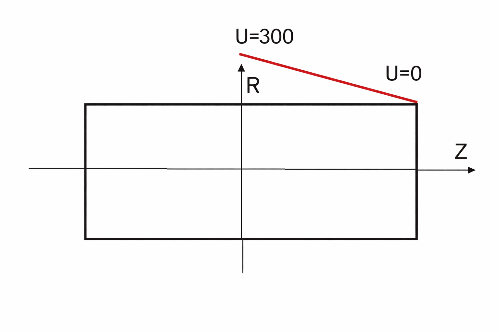

This project presents a numerical solution of the Laplace equation for the electric potential inside a solid cylindrical domain.

The physical problem describes a cylinder with grounded end surfaces (zero potential) and a prescribed electric potential on the lateral surface, which decreases linearly from 300 V at the axis of symmetry to zero at the edges. Due to the symmetry of the problem, the solution was computed for one quarter of the domain.

The Laplace equation was solved numerically in cylindrical coordinates using a finite-difference discretization. For computational convenience, the stationary Laplace problem was reformulated as a time-dependent diffusion equation. The steady-state solution was obtained through an explicit iterative scheme until convergence was reached.

Boundary conditions were implemented according to the physical symmetry and grounding constraints. The numerical grid was chosen uniform in radial and axial directions.

The implementation was carried out in MATLAB (version 6) as part of an academic course in mathematical and numerical modeling.

This project demonstrates experience with:
- mathematical modeling of physical processes
- numerical solution of partial differential equations
- finite-difference methods
- implementation of iterative algorithms

### Problem setup and geometry

### Numerical results

